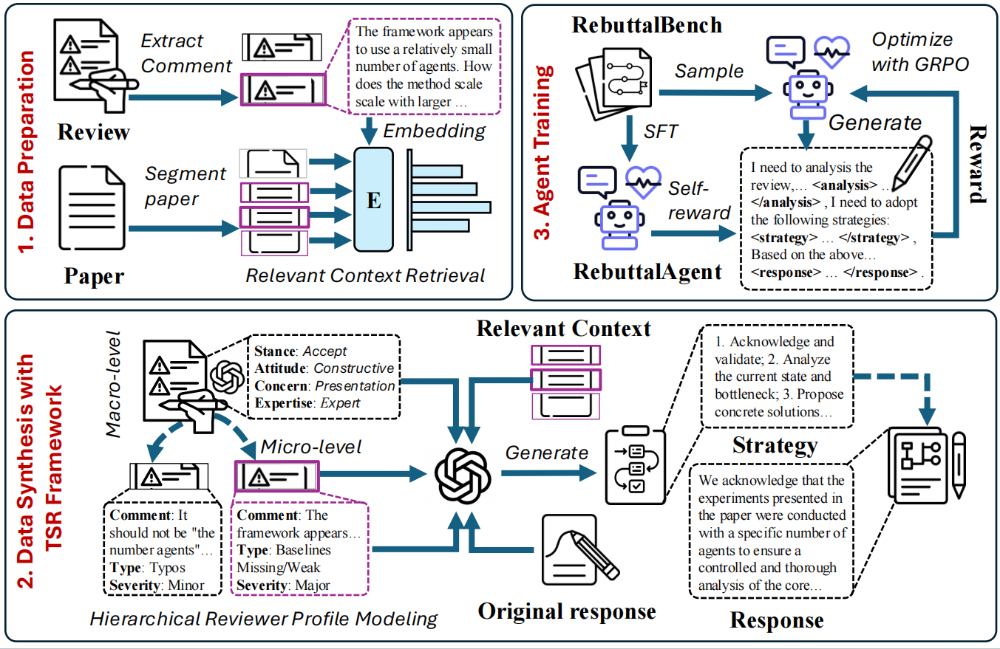

<div align="center">

# Dancing in Chains: Strategic Persuasion in Academic Rebuttal via Theory of Mind

</div>

<div align="center">
<b><a href="https://scholar.google.com/citations?user=ULvoYXgAAAAJ&hl=zh-CN" target="_blank">Zhitao He</a> <a href="https://github.com/Zhitao-He/RebuttalAgent" target="_blank"> Zongwei Lyu</a> <a href="https://mayrfung.github.io/" target="_blank">Yi R. (May) Fung</a></b>


<sup></sup>Hong Kong University of Science and Technology

[](RebuttalAgent_paper.pdf)
[](https://huggingface.co/RebuttalAgent)

</div>

<br>

## News

- **2025/10/30:** 🔥 **Our code and models** are released!

---



# Introduction
Although artificial intelligence (AI) has become deeply integrated into various stages of the research workflow and achieved remarkable advancements, academic rebuttal remains a significant and underexplored challenge. This is because rebuttal is a complex process of strategic communication under severe information asymmetry rather than a simple technical debate. Consequently, current approaches struggle as they largely imitate surface-level linguistics, missing the essential element of perspective-taking required for effective persuasion. In this paper, we introduce **RebuttalAgent**, the first framework to ground academic rebuttal in Theory of Mind (ToM), operationalized through a Theory-of-Mind-Strategy-Response (TSR) pipeline that models reviewer mental state, formulates persuasion strategy, and generates strategy-grounded response. To train our agent, we construct **RebuttalBench**, a large-scale dataset synthesized via a novel critique-and-refine approach. Our training process consists of two stages, beginning with a supervised fine-tuning phase to equip the agent with ToM-based analysis and strategic planning capabilities, followed by a reinforcement learning phase leveraging the self-reward mechanism for scalable self-improvement. For reliable and efficient automated evaluation, we further develop **Rebuttal-RM**, a specialized evaluator trained on over 100K samples of multi-source rebuttal data, which achieves scoring consistency with human preferences surpassing powerful judge GPT-4.1. Extensive experiments show RebuttalAgent significantly outperforms the base model by an average of 18.3\% on automated metrics, while also proving with advanced proprietary models across both automated and human evaluations. **The generated rebuttal content is for reference only, intended to inspire authors and assist in drafting. It cannot replace the author's own critical analysis and response.**


## Quick Start

```bash
# 1. Clone the repository
git clone https://github.com/Zhitao-He/RebuttalAgent
cd RebuttalAgent

# 2. Create & activate the conda environment
conda env create -f environment.yml
conda activate rebuttal-agent
```


## Construct data
Use following steps to construct data with our format:
1. **Use preference.py to do review analysis**
```bash
python preference.py 
```
2. **Use retrieve.py to retrieve paper fragments**
```bash
python retrieve.py 
```
3. **Use ag_refine.py to generate the ground truth of our data**
```bash
python ag_refine.py --model #powerful llm api 
```
## 🔧 SFT 
We use the [LLaMA-Factory](https://github.com/hiyouga/LLaMA-Factory) framework for Supervised Fine-Tuning (SFT). Run the following script:

```bash
llamafactory-cli train train\rebuttal_agent.yaml
```
## 🔧 RL Train

1. **Check Verl requirements to create and activate the environment***  
   See <https://verl.readthedocs.io/en/latest/start/install.html#requirements>

2. **Point the config to your data / model**
   ```bash
   export PROJ_ROOT=/absolute/path/to/your/project

   ```

4. **Launch training**
   ```bash
   ./grpo_train.sh                # run inside your env


## Citation

```bibtex
@misc{he2025danceinthechian,
      title={Dancing in Chains: Strategic Persuasion in Academic Rebuttal via Theory of Mind}, 
      author={Zhitao He and Zongwei Lyu and Yi R. Fung},
      year={2025},
      eprint={2505.23224},
      archivePrefix={arXiv},
      primaryClass={cs.CL},
      url={https://arxiv.org/abs/2505.23224}, 
}
```

## License

**Code:** Licensed under the [Apache 2.0 License](LICENSE).
 **Dataset:** Licensed under the [CC BY-NC 4.0 License](https://creativecommons.org/licenses/by-nc/4.0/).
 

##  Evaluation

1. **Use ag_eval_ours.py to evaluate our model's response**
```bash
python ag_eval_ours.py --model #model name you want to test
